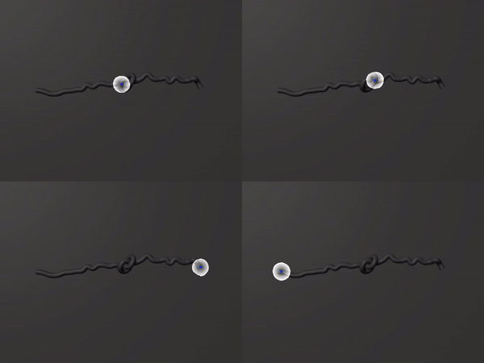

# hulk-keypoints

This repo provides training code for learning task-relevant keypoints for robotic manipulation tasks. We developed this repo for our CoRL 2020 paper to untangle cables in simulated and real environments. If you are interested, please check it out here:

#### ["Untangling Dense Knots by Learning Task-Relevant Keypoints"](https://sites.google.com/berkeley.edu/corl2020ropeuntangling/home)

#### Jennifer Grannen*, Priya Sundaresan*, Brijen Thananjeyan, Jeffrey Ichnowski, Ashwin Balakrishna, Minho Hwang, Vainavi Viswanath, Michael Laskey, Joseph E. Gonzalez, Ken Goldberg



**Abstract**: Untangling ropes, wires, and cables is a challenging task for robots due to the high-dimensional configuration space, visual homogeneity, self-occlusions, and complex dynamics. We consider dense (tight) knots that lack space between self-intersections and present an iterative approach that uses learned geometric structure in configurations. We instantiate this into an algorithm, HULK: Hierarchical Untangling from Learned Keypoints, which combines learning-based perception with a geometric planner into a policy that guides a bilateral robot to untangle knots. To evaluate the policy, we perform experiments both in a novel simulation environment modelling cables with varied knot types and textures and in a physical system using the da Vinci surgical robot. We find that HULK is able to untangle cables with dense figure-eight and overhand knots and generalize to varied textures and appearances. We compare two variants of HULK to three baselines and observe that HULK achieves 43.3% higher success rates on a physical system compared to the next best baseline. HULK successfully untangles a cable from a dense initial configuration containing up to two overhand and figure-eight knots in 97.9% of 378 simulation experiments with an average of 12.1 actions per trial. In physical experiments, HULK achieves 61.7% untangling success, averaging 8.48 actions per trial.

### Description

* `config.py`: training specifications
* `analysis.py`: inference code given a model checkpoint path and input image directory
* `train.py`: training code given an input data directory in the following format:
```
dataset_dir
├── test
│   ├── images
│   │   ├── 00000.jpg
│   │   ├── 00001.jpg
│   │   └── ...
│   └── keypoints
│       ├── 00000.npy
│       ├── 00001.npy
│       └── ...
└── train
    ├── images
    │   ├── 00000.jpg
    │   ├── 00001.jpg
    │   └── ...
    └── keypoints
        ├── 00000.npy
        ├── 00001.npy
        └── ...
``` 

### Contributing 
* If you have any features you'd like to see added or would like to contribute yourself, please let us know by contacting [Jennifer Grannen](http://jenngrannen.com/) at jenngrannen@berkeley.edu or [Priya Sundaresan](http://priya.sundaresan.us) at priya.sundaresan@berkeley.edu
